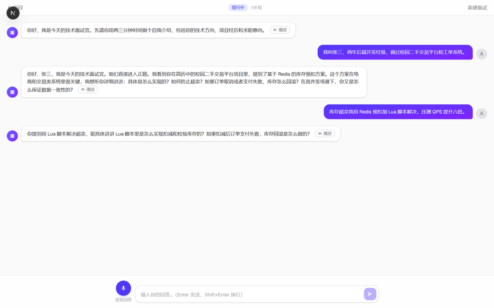
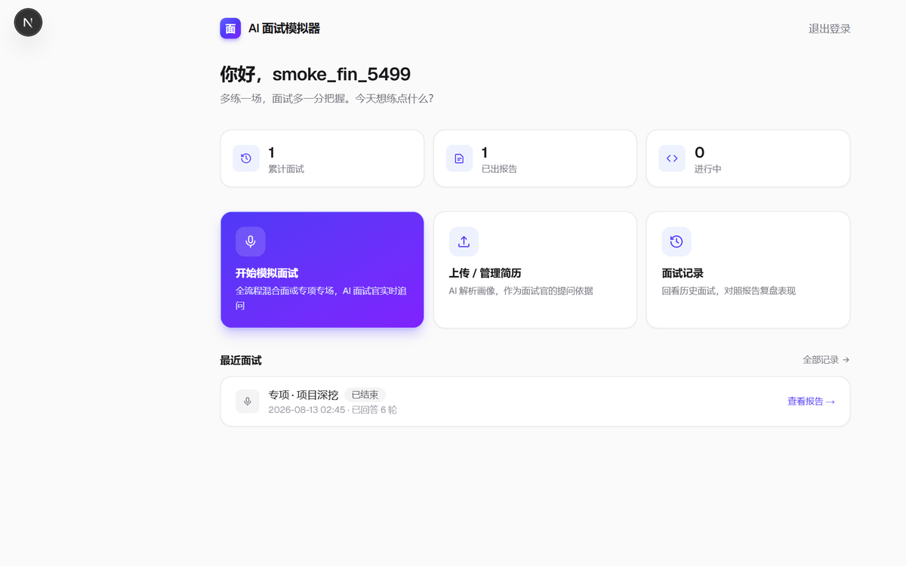
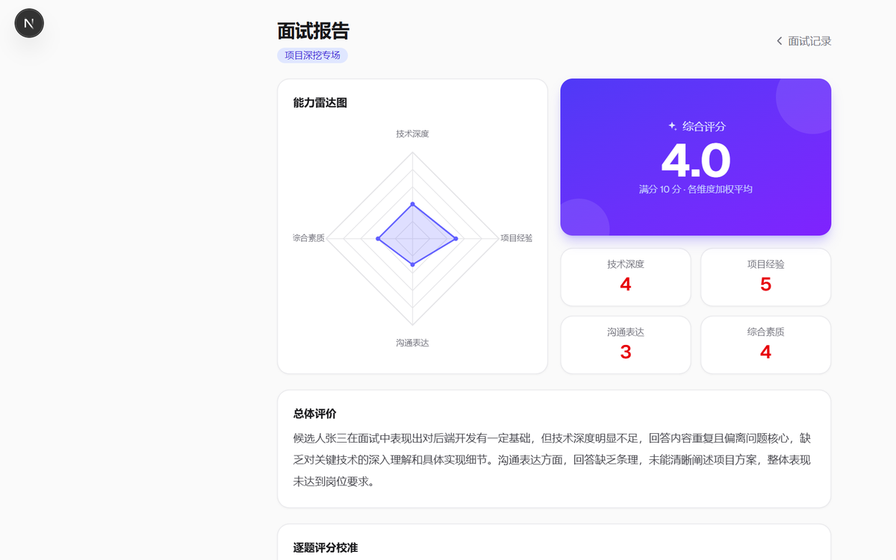

# 深问 DeepAsk

**往深处问，往 Offer 近**

面向计算机专业与互联网招聘的 AI 模拟面试平台。上传简历、选定岗位与企业，按真实一面的节奏推进——自我介绍、项目深挖、八股、手撕算法、HR，最后出可解释的量化报告。

> 产品介绍 PDF：[`docs/promo/深问产品介绍.pdf`](docs/promo/深问产品介绍.pdf)

作者：[@30bef100w](https://github.com/30bef100w)  
仓库：https://github.com/30bef100w/interview-agent



## 核心能力

| 模块 | 说明 |
|------|------|
| **工作台** | 开始面试、管理简历、面试记录、成长档案，练什么一眼看清 |
| **岗位定向** | 简历 + 岗位 + 目标企业拼题单，4.5 万+ 题库双路召回，优先匹配大厂高频原题 |
| **多轮追问** | Plan-then-Execute 状态机：开场规划题单，执行期按游标推进，模型不能改剧本 |
| **手撕判题** | 在线编辑器 + 本地对拍，AC/WA 由执行结果决定，模型只点评 |
| **语音作答** | 面试官 TTS 播报，候选人可文字或麦克风实时转写 |
| **可解释报告** | 雷达图、逐题复盘、参考答，支持导出 Word / PDF |
| **成长档案** | 跨场次看见短板，一键「针对性再练」预填模式与焦点 |

**核心立场：LLM 只负责说话，出什么题、何时追问、何时切下一题，全部由引擎决定。**

## 和「套一层 ChatGPT」差在哪

| 常见做法 | 深问怎么做 |
|---|---|
| 模型自己决定问什么 | 开场一次规划题单，执行期按游标推进 |
| 同一句话换个说法再问一遍 | 跨场去重：挡同一问法，不永封技术词 |
| 八股让模型现编 | 有题库时从库里抽，面试官只在候选池里选和润色 |
| 项目题泛泛而谈 | 按岗位路 + 场景路召回，再按简历项目生成拷打链 |
| 算法题靠模型说对错 | 本地执行参考解对拍，超时 / WA / AC 是跑出来的 |

```text
创建会话：开场官 → 多路召回 + 拷打链 → 规划题单 → 八股注入 → 去重补齐
     │
     ▼
执行中：自我介绍 → 出题 → 作答 → 追问∥评分 → 下一题 → 汇总终评
```

更细的设计：[`docs/设计文档-后端与Agent.md`](docs/设计文档-后端与Agent.md)

## 使用流程

1. 注册 / 登录（支持记住密码）
2. 上传简历，必要时跑一次 AI 简历分析
3. 开始面试：选全流程或专项、岗位、企业、轮次（规划阶段有进度条）
4. 文字或语音作答
5. 面试结束自动汇总报告，查看复盘或去成长档案看趋势

  


## 面向谁

- **计算机相关专业**：Agent / 后端 / 前端 / 算法 / 测试等方向
- **互联网招聘**：按岗位 + 目标企业（字节、阿里、腾讯等）定向练真题
- **简历驱动深挖** + **手撕判题** + **可解释报告**，贴近真实技术面流程

## 技术栈

- 前端：Next.js
- 后端：FastAPI
- 引擎：规划 / 检索 / 拷打链 / 去重 / 状态机（`backend/app/services/`）
- 模型：DeepSeek 等 OpenAI 兼容接口，Key 在设置页或 `.env` 配置

## 本地运行

需要 Python 3.11+、Node.js。

**后端**

```bash
cd backend
python -m venv .venv
# Windows: .venv\Scripts\activate
pip install -r requirements.txt
copy .env.example .env
# 编辑 .env，填入 DEEPSEEK_API_KEY，生产环境请改 JWT_SECRET
uvicorn app.main:app --reload --port 8001
```

Linux / macOS 把 `copy` 换成 `cp`。

**前端**

```bash
cd frontend
npm install
npm run dev
```

打开 http://localhost:3000 。前端默认请求 `http://localhost:8001`，可用 `NEXT_PUBLIC_API_BASE` 覆盖。

## 开源范围

本仓库开源**产品架构与代码**。自行整理的面经、结构化题库、算法题配置不随仓库分发。

| 要补的 | 放哪 | 不补会怎样 |
|---|---|---|
| LLM Key | `backend/.env` 的 `DEEPSEEK_API_KEY` | 后端能起，对话会失败 |
| 面试题库 | `backend/data/knowledge_base/questions_dedup.jsonl` | 八股召回为空，更多靠模型现编 |
| 讲解原文（可选） | `backend/data/knowledge_base/knowledge.jsonl` | 评分讲解素材变少 |
| 算法题配置（可选） | `backend/data/coding_problems.json` | 算法环节没有可判的题 |
| 语音模型（可选） | `backend/data/whisper-tiny/` | 语音输入不可用 |

**不要把 `.env` 提交进 git。**

## 目录

```
backend/app/       FastAPI、面试引擎、检索、评分、判题
backend/data/      岗位/企业/场景标签；题库与算法题需自备
frontend/          Next.js 界面
docs/              设计文档、产品介绍与迭代记录
```

## License

MIT
