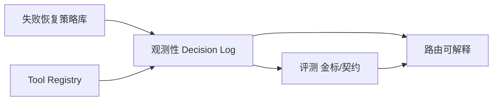

# AI 面试模拟器 — Agent 能力缺口分析报告

> 用途：校招答辩时，面试官用「评测 / 路由 / 工具协议 / 失败恢复 / 观测性」追问时的对照手册。  
> 结论先讲清楚：**不是「没有这些能力」，而是「有产品级雏形，缺平台级形态」**。  
> 配套文档：`设计文档-后端与Agent.md`、`迭代与踩坑历史.md`。  
> 日期：2026-08-14。

---

## 0. 总览

### 0.1 一句话定位

| 口径 | 档次 |
|------|------|
| 普通校招项目池 | 偏强：有完整闭环 + 硬约束控制面 |
| Agent 应用 / 落地岗 | 中上偏强：能讲清编排与履约 |
| Agent 平台 / 中台岗 | 中上：五个关键词有雏形，缺形式化与体系 |

### 0.2 五缺口总表

| 中台黑话 | 本项目已有（产品形态） | 主要缺口（平台形态） | 优先级* |
|----------|------------------------|----------------------|---------|
| 评测 | 引擎门禁 + FakeLlm 单测 + 代码判题 | 金标集、离线回归、线上质量指标 | P0 |
| 路由策略 | 题型路由 + 岗位硬过滤 + 八股瀑布 | 意图路由、学习式路由、多 Agent handoff | P1 |
| 工具协议 | 引擎编排检索/判题/额度 | LLM 原生 function calling / MCP / 统一 Tool Schema | P1 |
| 多步规划失败恢复 | fallback plan、瀑布回退、追问触顶换题 | 中途重规划、显式 Plan Revision、反思重试 | P1 |
| 观测性 | 用量、额度流水、Admin 日志 | Trace/Span、Prompt 版本、失败归因看板 | P0 |

\*优先级按「答辩加分 / 上线可运营」综合：先能证明质量与可排查，再堆协议名词。

### 0.3 答辩统一口径（背这段）

> 路由我做在题型比例和岗位/企业召回上；失败恢复做在规划降级和八股瀑布；评测目前偏引擎门禁和单测，还没上金标回归；工具是引擎编排服务而不是模型原生 tool-call；观测有用量和运维日志，还没上全链路 trace。下一步会先补评测集和 trace，再考虑工具协议标准化。

---

## 1. 评测（Evaluation）

### 1.1 已有能力（不要说没有）

| 能力 | 落点 | 解决什么 |
|------|------|----------|
| 引擎评分门禁 | `sanitize_score_fields`、空答封顶 1 分 | 防「下一个」得高分 |
| strengths 可核验 | 与作答原文重叠校验 | 防把题干知识点写成优点 |
| 终评消毒 | `_sanitize_report` | 二次幻觉收敛 |
| 状态机单测 | `FakeLlm` + `test_state_machine.py` 等 | 不花钱锁住阶段迁移、追问上限、八股来源 |
| 八股来源断言 | `test_bagu_bank.py` | 锁「from_bank / 企业硬过滤」产品承诺 |
| 算法判题 | `code_judger` 示例/对拍 | 客观对错，不靠模型嘴硬 |

这些本质是 **「约束正确性评测」** 和 **「判题评测」**，对产品履约非常关键。

### 1.2 缺口是什么

面试官说的「评测」通常指 **Agent / 生成质量的系统化评估**，本项目还缺：

| 缺口 | 说明 | 被追问风险 |
|------|------|------------|
| 金标集（Golden Set） | 固定简历 × 岗位 × 企业 → 期望题型分布 / 禁止考点 / 期望是否带原题徽标 | 「你怎么证明改完搜广推真的不问 Redis？」只能口述 |
| 离线回归 | CI 里跑一批会话（可用 FakeLlm 或小流量真模型），对比基线 | 改 Prompt 易回退，无自动报警 |
| 维度化质量指标 | 例如：岗位相关度、题库命中率、幻觉句比例、空答误杀率 | 无法量化迭代 |
| 人工抽检工作流 | 运营抽 N 场打标 | 上线后难运营 |
| 线上反馈闭环 | 用户对报告/题目点赞点踩 → 回流 | 无产品信号 |

### 1.3 建议补齐路径（由易到难）

**P0-a：契约评测（1–2 天量级，答辩最值）**

用 FakeLlm + 固定 fixture，断言例如：

- `target_role=搜广推` → plan 中 ba_gu/project 的 topic/text **不得**高频命中「缓存击穿/Redis」类禁用表（可维护 deny-list）  
- `target_company=字节跳动` → 前 K 道 `from_bank` 八股的 `company` **必须**为 `bytedance`（在池充足时）  
- 空答 → score ≤ 1，strengths 为空  
- 规划官返回 ba_gu → 最终 plan 中 ba_gu 必须 `from_bank=True`

> 这叫 **Contract Eval / Property-based checks**，大厂也认，而且和你现有单测一脉相承。

**P0-b：小金标集（3–5 天）**

准备 10–20 个「会话配方」JSON：

```text
input:  resume_fixture, target_role, target_company, mode
expect: min_bagu_from_bank, required_badge_company?, forbidden_topics[], must_have_types[]
```

每次改检索/规划跑一遍，输出 pass rate。

**P1：真模型抽检（可选）**

对金标子集打真实 LLM，人工或 LLM-as-judge 打「岗位相关度 1–5」，只做趋势，不当唯一真理。

### 1.4 答辩话术

**问：你们有评测吗？**  
> 有两层。第一层是履约评测：空答封顶、strengths 证据校验、八股必须来自题库、企业硬过滤，都有单测钉死。第二层是质量金标集和线上指标，目前还在建设；我优先保证「产品承诺不被模型破坏」，再扩展到「问得好不好」的主观质量评测。

---

## 2. 路由策略（Routing）

### 2.1 已有能力

本项目的「路由」是 **多层、可解释的规则路由**，不是空白：

```text
会话模式路由
  full / specialized(ba_gu|project|hr)
        ↓
题型比例路由（ROUTER_SYSTEM → 引擎 clamp）
  project_n / ba_gu_n / hr_n
        ↓
内容路由（岗位 / 企业）
  resolve_target_roles → roles 硬过滤
  resolve_company_id → pick_bagu 瀑布
        ↓
阶段路由（状态机）
  INTRO → ASKING → ASK_BACK → FINISHED
        ↓
题内路由
  追问 or 下一题 or 算法提交
```

| 路由层 | 决策依据 | 代码感观 |
|--------|----------|----------|
| 模式路由 | 用户选择 | `interview_mode` / `interview_type` |
| 比例路由 | 简历厚度 + 岗位（LLM 建议） | `ROUTER_SYSTEM` + clamp |
| 召回路由 | 岗位硬门槛、企业硬过滤（出题时） | `_plan_retrieval` / `pick_bagu_*` |
| 对话路由 | 追问官 + 上限 + 轮次 | `handle_answer` |
| 降级路由 | 规划失败、交叉为空 | `_fallback_plan`、瀑布 |

### 2.2 缺口是什么

| 缺口 | 平台岗期待 | 你这边现状 |
|------|------------|------------|
| 意图路由 | 用户一句话 → 技能/工具/子 Agent | 面试场景固定，意图空间窄，未单独建模 |
| 学习式路由 | 根据历史效果调比例 | 比例靠 LLM + 规则 clamp，无在线学习 |
| Multi-agent handoff | 显式 Agent 卡 + 交接协议 | 同进程 Prompt 切换，无独立 Agent 运行时 |
| 动态重路由 | 发现候选人很强 → 中途加难/改题型配比 | 创建时 plan 基本固定（追问局部动态） |

### 2.3 建议补齐路径

**P1-a：把现有路由「命名并文档化」**（零代码也能加分）  
答辩时画上面那张分层图，明确说：我们是 **policy-based routing**，优先可解释。

**P1-b：轻量中途重路由（有代码价值）**

- 连续 2 题空答 → 降低追问倾向 / 切换更基础库内题  
- 连续高分 → 提高拷打链深度（不必重做整表）  

**P2：学习式路由**  
用历史报告的维度分，微调默认 `project/ba_gu` 先验——有数据再做，避免空谈。

### 2.4 答辩话术

**问：路由策略怎么做的？**  
> 我没有上复杂的意图分类器，因为面试域的意图相对封闭。路由拆成五层：模式、题型比例、岗位企业召回、状态机阶段、题内追问。比例层用 LLM 建议但引擎 clamp；召回层对岗位和企业分别用硬过滤，避免「软提示路由」失效——这正是我们修搜广推跑偏和字节徽标错乱时验证过的。

---

## 3. 工具协议（Tool Protocol）

### 3.1 已有能力

引擎已经在调一组「工具型能力」，只是 **调用方是代码，不是模型的 tool-call 环**：

| 能力 | 形式 | 谁触发 |
|------|------|--------|
| 知识检索 | `retrieve` / `pick_bagu_questions` | 创建规划时引擎 |
| 项目拷打链 | `build_project_chains` | 创建规划时引擎 |
| 算法运行/提交 | `/code/run` `/code/submit` | 前端 + 引擎 |
| 额度门禁 | `assert_platform_allowed` | 创建会话 |
| TTS/STT | voice API | 前端 |

也就是：**Tool 存在，Protocol 偏内部 Service Call。**

### 3.2 缺口是什么

| 缺口 | 含义 |
|------|------|
| 统一 Tool Schema | 名称、参数 JSON Schema、错误码、超时、幂等键 |
| LLM 原生 tool-calling | 模型决定何时检索/何时判题（当前由状态机决定） |
| MCP / OpenAPI tools | 对外可插拔工具生态 |
| 工具权限与审计 | 哪个角色能调哪个工具、调用链落库 |

对模拟面试产品，**状态机握权往往更安全**（避免模型乱调工具）。缺口主要是「说不清协议」和「难扩展第三方工具」，不是功能为零。

### 3.3 建议补齐路径

**P1：Tool Registry（推荐，工程清晰）**

```text
ToolSpec = {
  name, description, input_schema, output_schema,
  timeout_ms, retry_policy, who_can_call: ["engine"|"llm"]
}
```

先把 `retrieve_bagu`、`run_code`、`submit_code`、`deduct_quota` 注册进去，日志统一 `tool_name + latency + ok/err`。

**P2：局部开放给 LLM**  
仅在「出参考答案补充材料」等低风险场景允许模型发起 `search_knowledge`；出题与扣费仍引擎独占。

**P3：MCP**  
有对外集成需求再上；校招叙事提到「可演进到 MCP」即可，不必先做。

### 3.4 答辩话术

**问：有没有工具协议？**  
> 有工具，协议目前是引擎侧的服务调用，而不是把 tool-call 交给模型。原因是面试场景里「出什么题、扣不扣费、是否原题」属于履约承诺，必须确定性。我规划的下一步是做成统一 ToolRegistry（schema + 超时 + 审计），再在低风险只读工具上开放模型调用。

---

## 4. 多步规划失败恢复（Planning Failure Recovery）

### 4.1 已有能力

你已经有一条相当完整的 **降级链**，这就是失败恢复，只是名字不叫 ReAct/Reflexion：

```text
ROUTER 给出极端比例
  → clamp / budget 缩放 / 八股保底
PLANNER 抛错或空结果
  → _fallback_plan
PLANNER 偷塞 ba_gu
  → 丢弃，改由题库注入
目标企业×岗位交叉为空
  → 本企业不限岗位 → 其他企业真题 → 无标签
追问无效 / 触顶 / 轮次满
  → 强制下一题
算法题不可用
  → 不插入 / skip_coding
出题 LLM 失败
  → chat_text 回退；八股则根本不走 LLM
```

| 失败模式 | 恢复策略 | 是否已有 |
|----------|----------|----------|
| 规划 JSON 失败 | fallback 题签 | ✅ |
| 题源不足 | 瀑布扩池 | ✅ |
| 追问死循环 | 上限 2 + 换题 | ✅ |
| 评分幻觉 | 门禁改写结果 | ✅（结果修复，非重规划） |
| 中途发现整场跑偏 | 重跑 ROUTER/PLANNER | ❌ |
| 模型持续胡问 | 反思后改写 plan | ❌ |

### 4.2 缺口是什么

平台语境下的「多步规划失败恢复」常包括：

1. **显式 Plan 对象**（步骤、依赖、状态：pending/done/failed）  
2. **失败分类**（transient / logic / policy）  
3. **恢复策略库**（retry / skip / replan / human-in-the-loop）  
4. **中途 Replan**（根据候选人表现改后续题单）  

你现在是 **创建时一次规划 + 局部运行时降级**，还不是 **持续规划回路**。

### 4.3 建议补齐路径

**P1：把降级策略表格化进代码注释/配置**（文档化即加分）  
**P1：轻量 Replan 触发器**

- 条件：前 2 道主问题均为空答，或用户显式「太偏了」  
- 动作：仅重抽剩余 ba_gu / 降低追问；不推翻已问历史  

**P2：Plan 结构化**

```json
{ "steps": [{"id":"q3","type":"ba_gu","status":"pending","source":"bank","recovery":["widen_company","untagged"]}] }
```

### 4.4 答辩话术

**问：规划失败怎么恢复？**  
> 我们是「一次规划 + 多层降级」。规划失败有 fallback；题源稀疏有企业→他企→无标签瀑布；对话失败有追问上限和强制换题。目前还没有根据中途表现重规划整张题单；这是有意的——面试要保持结构稳定，恢复优先保证可继续考完，而不是让模型反复改剧本。

---

## 5. 观测性（Observability）

### 5.1 已有能力

| 信号 | 落点 | 用途 |
|------|------|------|
| LLM 用量 | `LLMUsage`（含是否平台 Key） | 成本、计费 |
| 额度审计 | `QuotaGrant` | 商业与客服 |
| 系统错误日志 | `SystemLog` + Admin `/logs` | 运维排障 |
| 会话快照 | `state_json` / `report_json` | 事后复盘单场 |
| 用户活跃 | `last_active_at`、Admin stats | DAU/MAU |

这是 **业务观测 + 成本观测**，上线最小可用。

### 5.2 缺口是什么

| 缺口 | 平台期待 | 影响 |
|------|----------|------|
| 分布式 Trace | 一次答题：路由→评分→追问→写库 的 span | 难定位「慢在哪 / 挂在哪」 |
| Prompt 版本 | 每次调用记录 prompt_hash / 模板版本 | 改 Prompt 无法对比 |
| 决策日志 | 为何选这道八股、为何不追问 | 踩坑难复现（现靠读 state） |
| 质量看板 | 幻觉率、原题命中率、空答误杀 | 迭代无仪表盘 |
| 告警 | 错误率、延迟、额度异常 | 只能人肉看 Admin |

### 5.3 建议补齐路径

**P0：Decision Log（强烈建议）**

在 `create` / `handle_answer` 关键路径写结构化事件（可先落 SQLite JSON）：

```json
{
  "session_id": 36,
  "event": "pick_bagu",
  "target_company": "bytedance",
  "stage": "company_any_role",
  "picked": [{"company":"bytedance","q_norm":"..."}],
  "latency_ms": 12
}
```

答辩时可直接展示「字节场为何没出其他海外」——比事后猜强。

**P0：统一 request_id**  
API → engine → llm 调用串起来。

**P1：Prompt hash + latency** 写入 `LLMUsage` 扩展字段。  
**P2：** OpenTelemetry / 简单 Jaeger；校招叙事提到即可。

### 5.4 答辩话术

**问：观测性怎么做？**  
> 业务侧已有用量、额度流水和错误日志，单场可以用 state/report 复盘。缺的是 Agent 决策级观测：我准备补 decision log（例如八股瀑布停在哪一层）和 prompt 版本号。这样像「选了字节却标其他海外」这类问题，可以靠事件直接定位，而不是只靠猜。

---

## 6. 缺口之间的依赖关系



**建议落地顺序（务实）：**

1. **Decision Log + 契约评测**（把已有承诺测住、可讲述）  
2. **Tool Registry**（把已有服务显式化）  
3. **轻量 Replan 触发器**  
4. 真模型金标 / Trace 平台化  

不要一上来先做 MCP——名词好看，但对当前产品边际收益低。

---

## 7. 面试官追问「那你还差得远吧？」如何接

**接法 A（自信边界）：**  
> 如果对标 Agent 中台，确实还差评测体系和 trace。但如果对标「可上线的垂直 Agent 应用」，控制面、降级链和题库履约是我有意优先的；平台化是下一阶段，不是当前失败。

**接法 B（转化成成长性）：**  
> 这五个词我都能映射到现有模块。我的迭代顺序是先保证承诺不被模型破坏，再补能量化与可观测的平台能力——这也是我们从搜广推、徽标、字节错标里学到的：先 hard filter，再仪表盘。

---

## 8. 可写进简历的「缺口意识」表述（可选）

> 在模拟面试 Agent 中实现了多层路由、规划降级与履约门禁；并明确区分业务观测与 Agent 决策观测，规划以契约评测与 decision log 补齐质量闭环，避免只堆模型能力。

---

## 附录：缺口 → 现有代码锚点

| 主题 | 已有锚点 | 拟增锚点（建议） |
|------|----------|------------------|
| 评测 | `tests/test_*.py`、`sanitize_*` | `tests/test_contracts_*.py`、`data/eval_fixtures/` |
| 路由 | `ROUTER_SYSTEM`、`_plan_counts`、`pick_bagu_*` | 路由分层注释图；中途 replan 钩子 |
| 工具 | `knowledge_retrieval`、`code_*`、`billing` | `services/tool_registry.py` |
| 恢复 | `_fallback_plan`、瀑布、追问上限 | `RecoveryPolicy` 配置表 |
| 观测 | `LLMUsage`、`SystemLog`、Admin | `decision_events` 表 / JSONL |

---

*完。建议答辩前：把第 0.3 节口径背熟，并各选一个「已有例子」（搜广推硬过滤、字节瀑布、空答门禁）挂到五个词下面。*
