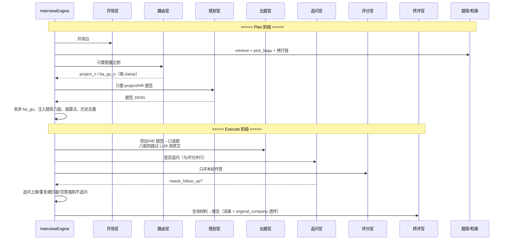

# AI 面试模拟器 — 后端与 Agent 设计文档（亮点版）

> 校招答辩主文档。先讲 **亮点怎么做的**，再讲架构。  
> 配套：`迭代与踩坑历史.md`、`Agent能力缺口分析.md`。  
> 对齐代码：`interviewer_engine.py` / `knowledge_retrieval.py` / `prompts/interview.py` / `api/interview.py`。

---

## 0. 30 秒亮点（面试开场）

本系统不是「套一层 ChatGPT」，核心是五件事：

1. **Plan-then-Execute + 状态机**：开场一次规划题单，执行期按 `cursor` 推进；LLM 只产语言，履约约束在引擎。  
2. **多维标签知识库 + 分层召回**：一级分类/岗位/企业/业务场景/技术场景/时效；硬门槛与 boost 分家；八股瀑布履约。  
3. **结构化知识库检索**：≈1.2 万去重题 + 原文块；八股强制库内抽取，优先企业原题。  
4. **多角色 Agent 分工 + 上下文隔离**：路由/规划/出题/追问/评分/终评各看不同材料。  
5. **面向体验的多层去重**：跨场问法/召回降权、本场分散、追问硬拦截——挡换句重复，不封杀知识点。

产品铁律：**目标岗位定方向，简历只当素材；控制面在引擎，不在模型。**
---

## 1. 总体架构：Plan-then-Execute + FSM

```text
┌──────────────────────── Plan（创建会话时一次完成）────────────────────────┐
│ 开场官 → 检索 RAG + 拷打链 → 路由官(题量) → 规划官(项目/HR题签)          │
│        → 题库强制注入八股 → [可选算法题] → 历史去重裁剪 → plan[] 就绪     │
└───────────────────────────────────┬─────────────────────────────────────┘
                                    │ stage=INTRO
┌──────────────────────── Execute（多轮）─────────────────────────────────┐
│ 自我介绍 → ASKING：出题 → 作答 → 追问官∥评分官 → 追问或下一题            │
│         → 题尽 ASK_BACK → 终评官 → FINISHED                              │
└─────────────────────────────────────────────────────────────────────────┘
```

| 名称 | 是否符合 |
|------|----------|
| Plan-and-Execute | ✅ 有清晰 Plan / Execute 两段 |
| 强闭环 Replan | ❌ 整场题单基本固定；只有降级与局部追问 |
| ReAct | 仅题内追问略像；整场不是 |
| Multi-Agent | ✅ 多角色 Prompt；❌ 非独立进程集群 |

**答辩一句**：Plan-then-Execute；执行期用状态机握权；失败靠降级链而不是让模型改剧本。

---

## 2. 亮点一：多维标签体系（知识库「复杂在哪」）

> 答辩重点：不是「堆了 1 万道题」，而是 **标签怎么切、为什么这样切、和召回怎么咬合**。

### 2.1 为什么不用「按公司拆表 / 按岗位拆库」

| 方案 | 问题 |
|------|------|
| 每家公司一个库 | 通用八股（JVM/MySQL）大量重复；无公司优质题（JavaGuide）无处放 |
| `腾讯_Java_电商` 笛卡尔表 | 组合爆炸；一题多标签塞不进；维护成本爆 |
| 只按文件路径分类 | 无法按用户「目标岗+目标企」组合查询 |

**定案：单库 + 多维标签。** 一题可挂多个 `roles`，`company` 可空；查询时按维度组合过滤/加分。

### 2.2 标签维度总览

```text
                    ┌─ category: bagu | project          （题型池，硬隔离）
                    ├─ roles[]: java_backend, recsys…   （岗位，可多标）
一条题 ─────────────┼─ company: tencent | null           （企业，可空=通用题）
                    ├─ business_scene[]: ecommerce…     （业务场景）
                    ├─ tech_scene[]: cache, mq…         （技术特征）
                    └─ era: 2025 | 2023 | …             （时效，用于降权）
```

配置与数据：

| 维度 | 配置/数据 | 规模感 |
|------|-----------|--------|
| 一级岗位分类 → role_id | `job_roles.json` → `categories` + `roles` | 9 大类 / ~23 个岗位 |
| 企业 id / 别名 / 展示名 | `companies.json` | 腾讯/字节/阿里… + 别名归一 |
| 业务场景 ④a | `project_scenes.json` → `business_scenes` | 电商、外卖、IM、搜推、金融… |
| 技术场景 ④b | 同上 → `tech_scenes` | 高并发、缓存、分布式、RAG… |
| 题库条目 | `questions_dedup.jsonl` | ≈12287 去重题 |
| 原文块 | `knowledge.jsonl` | 终评参考答扩写 |

语料侧（构建报告）：26+ GitHub 面经/教程仓 → 清洗入库；岗位标签覆盖约 90%，企业约 39%（弱标签，故检索要防噪音淹没）。

### 2.3 岗位标签：两级分类 + 反歧义关键词

**一级分类**（用户 UI 选大类时展开）：后端 / AI 应用与算法 / 前端 / 移动 / 数据 / 测试 / 运维 / 安全 / 嵌入式。  

**二级 role_id**（检索真正用的稳定 id）：

| 大类 | 例 |
|------|-----|
| 后端开发 | `java_backend` `go_backend` `cpp_backend` `python_backend` `php_backend` |
| AI 应用与算法 | `agent_dev` `llm` `aigc` `nlp` `cv` **`recsys`（搜广推）** `ml_dm` |
| 数据 | `big_data` `data_analysis` |
| … | … |

每个 role 带 **keywords**（命中简历/题面用）。设计要点：

- **避开歧义**：Java 岗用 `spring`/`jvm`/`dubbo`，不用裸词 `java`（否则误伤）  
- **用户文案 → id**：`resolve_target_roles`  
  - 「搜广推」→ `[recsys]`  
  - 「Java 后端」→ `[java_backend]`  
  - 「后端开发」→ 该大类下全部 backend id  
  - 再不行 → `infer_roles(profile)` 按关键词计数排序  

**主标签 vs 次标签**：题的 `roles[0]` 视为主岗位。打分时：主岗命中 +80，仅次标签命中 +35——弱标签噪音多时，优先「真的是这岗的题」。

### 2.4 企业标签：id / 别名 / 展示名三件套

```text
前端展示「字节跳动」──resolve_company_id──► bytedance（库内 company 字段）
报告徽标 ◄──company_display_name──「字节跳动」
```

- 入库与检索一律用 **id**  
- UI / 报告用 **中文名**  
- `aliases` 覆盖「字节」「抖音」「bytedance」等  

踩过的坑：前端传「腾讯」、库是 `tencent`，全等失败 → 徽标永不亮。必须在边界归一。

### 2.5 场景双标：④a 业务 + ④b 技术（为什么拆开）

| | ④a `business_scene` | ④b `tech_scene` |
|--|---------------------|-----------------|
| 回答 | 「在什么业务里考」 | 「考什么技术特征」 |
| 例 | 电商/交易、外卖、IM、搜推 | 高并发、缓存、MQ、RAG |
| 若不拆 | 「秒杀」和「缓存击穿」糊成一个场景，CRUD 题与高并发行题分不开 | |

召回时：`scenes_set` 与题的 `(business_scene ∪ tech_scene)` 求交加分。  
**有目标岗位时场景只弱加分（×15）**；无岗位时更强（×40）——防止脏 `scene_tags` 把搜广推拽成 Agent/RAG（已踩坑）。

### 2.6 题型 category + 时效 era

- **`bagu` / `project`**：池硬隔离；八股履约只抽 `bagu`。  
- **`era` 权重**（乘在总分上）：

| era | 权重 |
|-----|------|
| ≥2025 | ×1.0 |
| 未知 | ×0.8 |
| ≥2023 | ×0.7 |
| ≥2021 | ×0.4 |
| 更早 | ×0.2 |

旧面经仍可作拷打方式参考，但排序上让新题优先。

### 2.7 标签设计原则（可背）

1. **标签正交**：岗位 ≠ 企业 ≠ 业务场景 ≠ 技术特征  
2. **可空**：无企业题是一等公民（通用八股）  
3. **可多值**：一题多 `roles`，但用主标签权重压制弱标噪音  
4. **词典外置**：岗位/企业/场景都在 JSON，改配置不用改代码  
5. **硬门槛 vs 软加分分家**：岗位在有目标时硬过滤；企业在宽召回 boost、在履约抽取 hard filter  

---

## 3. 亮点一（续）：召回逻辑全链路

### 3.1 两条链路，目的不同

| | ① `retrieve` 规划佐料 | ② `pick_bagu_questions` 八股履约 |
|--|----------------------|----------------------------------|
| 给谁 | 规划官 Prompt | 直接进 `plan[]`，候选人听到的题面 |
| category | 可不限 / 混合 | **强制 bagu** |
| 企业 | **boost +120**，保底塞进 pool | 阶段内 **`company==target` 硬过滤** |
| 失败形态 | 素材差一点还能改写 | 抽错企业 = 产品翻车（徽标打脸） |
| 输出 | `format_hits` 文本（可带【企业原题·腾讯】） | `bank_question` / `bank_answer` / `original_company` |

### 3.2 单题打分 `_score_question`（可画白板）

```text
若 category 不匹配 → 0
score = 0
若有目标 roles:
    无角色交集 → 0          ← 硬门槛
    主角色命中 → +80；仅次角色 → +35
    题面/答案命中该岗 keywords → 每个 +12（最多 6 个）
若 company 命中 → +120       ← 宽召回 boost（此处还不是硬过滤）
场景交集数 × (有岗?15:40)
技能命中数 × (有岗?4:10)
若总分 ≤0 → 0
score *= era_weight
若题面以「是什么？」结尾 → ×0.3
```

### 3.3 `retrieve` 流水线

```text
全库扫描
  → 丢弃 _is_noisy（攻略/碎片/roles>3/无技术词短句…）
  → 打分，过滤 min_score（规划常用 20~30）
  → asked_norms 命中：分 ×0.1（跨场去重）
  → 按分排序，取 pool_size（默认 30）
  → 若指定企业且 pool 内没有该公司题：强制塞入最多 2 道企业题保底
  → 主题分散抽取 top_n：
        每次取当前最高分；
        用题面 2-gram 并入已选集合；
        与已选 bigram 交集 ≥3 的剩余题分 ×0.5
  → 返回 hits
```

**主题分散**解决：高分全是「Redis 穿透/击穿/雪崩」变体，一场素材同质化。

**噪音过滤**解决：弱标签把「秋招攻略」「简历怎么写」标成后端题 —— 错召回比空召回更伤。

### 3.4 `pick_bagu` 瀑布（履约）

```text
1) 目标企业 × 目标岗位   （retrieve/search 后 hard filter company）
2) 目标企业 × 不限岗位   （交叉为空时先吃本厂真题池，如字节×大数据）
3) 同岗位、任意企业真题  （有 company 标签优先）
4) 同岗位、无企业标签
5) 全库 bagu 兜底
每步用 question_norm 去重；尊重 asked_norms
```

徽标：`original_company` = 题真实来源企业的展示名（本企或其他企均可；无标签则不标）。

### 3.5 引擎侧如何把标签用起来（`_plan_retrieval`）

```text
有 target_role → resolve_target_roles → roles[]
否则 → infer_roles(profile)[:3]

company_id = resolve_company_id(target_company)   # 腾讯→tencent

有 roles 时：
  不用简历 scene_tags 主导召回（防脏场景）
  skills 只取前 6 个弱加分
无 roles 时：
  可用 scene_tags + 全量 skills

retrieve(...) → format_hits → state.retrieved_material   # 给规划官
pick_bagu(...) → 写入 plan 的 ba_gu                    # 给候选人
并行 build_project_chains(role_ids=roles)              # 岗位视角拷打
```

### 3.6 和拷打链的分工

| 模块 | 标签依赖 | 产出 |
|------|----------|------|
| 题库召回 | category/roles/company/scenes/era | 真题与规划素材 |
| `project_cross` | 目标 role_ids + 简历项目 | 岗位视角追问链 |
| 规划官 | 读素材+链，**禁止产出 ba_gu** | 项目/HR 题签 |

**金句**：标签体系解决「题海如何被目标岗/企切开」；召回分层解决「宽召回可脏、履约必须干净」；拷打链解决「项目题怎么挖得像真人」。

### 3.7 答辩白板最小版

```text
多维标签: category × roles × company × (biz|tech scene) × era
     ↓
宽召回 retrieve: 岗位硬过滤 + 企业boost + 分散 + 降噪 + 历史×0.1
     ↓
履约抽取 pick_bagu: 企业硬过滤瀑布（本企岗→本企→他企→无标）
     ↓
规划官只看素材；候选人听库内原文八股
```

---

## 4. 亮点二：多 Agent 工作流 —— 谁干什么、如何配合

### 4.1 角色与编排（不是一起聊天）

引擎是导演；每个角色是一次（或并行一次）带独立 System Prompt 的 LLM 调用。



### 4.2 配合关系（答辩用）

| 步骤 | 上游产出 | 下游怎么用 |
|------|----------|------------|
| 路由官 | 题量 | 引擎 clamp 后告诉规划官「出几道项目/HR」；八股数量给题库抽取 |
| 检索 | `retrieved_material` | **只给规划官**当素材，要求改写、禁止照搬 |
| 拷打链 | `project_chains` | 规划官规划项目题；出题官/追问官在 **项目题** 时注入 |
| 规划官 | project/hr 题签 | 出题官选 1 个 key_point 问出口语题 |
| 题库八股 | `bank_question` | 出题官 **不调用**，原文提问 |
| 追问官∥评分官 | 并行 | 降低延迟；引擎决定是否采纳追问 |
| 终评官 | 报告 JSON | 引擎消毒；主问/追问拆条；原题字段透传 |

### 4.3 上下文隔离矩阵（谁能看到什么）——核心亮点

> 原则：**需要决策的人给足材料；需要防幻觉的人切断诱因。**

| 上下文材料 | 开场 | 路由 | 规划 | 出题(项目/HR) | 出题(八股) | 追问 | 评分 | 终评 |
|------------|:----:|:----:|:----:|:-------------:|:----------:|:----:|:----:|:----:|
| 简历原文/画像 | ✅ | ✅ | ✅ | ✅ 白名单式 | ❌ 不调 LLM | ✅ | ✅ 标成 A 区禁写入 strengths | ✅ 标成背景 |
| 目标岗位/企业 | ✅ | ✅ | ✅ | ✅ | — | ✅ | △ 不在主证据 | ✅ |
| 历史去重 avoid_topics | ✅ | ✅ | ✅ | ✅（在 ctx） | — | ✅ | ❌ | △ |
| 检索素材 retrieved_material | ❌ | ❌ | ✅ | ❌ | — | ❌ | ❌ | ❌ |
| 项目拷打链 | ❌ | ❌ | ✅ | ✅ 本题相关 | — | ✅ 项目题 | ❌ | ❌ |
| 本题题签/rubric | ❌ | ❌ | 自产 | ✅ | 库内题面 | ✅ | ✅ B/C 区 | ✅ |
| 本场已问主题/摘要 | ❌ | ❌ | ❌ | ✅ | — | ✅ 已问列表 | ❌ | ✅ |
| 本题对话史 | ❌ | ❌ | ❌ | 摘要级 | — | ✅ | 仅 D=本轮答 | 全场作答 |
| 预置参考答案 | ❌ | ❌ | ❌ | 自产 | 库内 answer | 追问参考答 | ❌ | ✅ 优先沿用 |
| 引擎预评分 | ❌ | ❌ | ❌ | ❌ | — | ❌ | 自产 | ✅ 仅参考可推翻 |

**为什么评分官要隔离？**  
若把题干、rubric、简历和作答糊在一起，模型会把「该会的」写成「答到了」。所以评分上下文强制 A/B/C/D 分区，**strengths 只能来自 D**，引擎再做字面重叠与空答封顶。

**为什么规划官独享检索素材？**  
避免出题官照搬题面变成「念题机器」；规划只要题签，出题再口语化；八股则直接念库内真题，连改写都禁止。

**为什么追问官能看拷打链和已覆盖摘要？**  
要它「像真人顺着挖」，但必须用已问列表 + `_is_repeat_followup` 硬拦截换句重复。

---

## 5. 亮点三：面向用户体验的去重体系

用户痛点：二刷/三刷总撞题，或一道题追问三轮都在问「缓存穿透」。  
设计目标：**同一问法不要反复出现；同一知识点允许换角度再练。**

### 5.1 四层去重

```text
L1 跨场召回去重 asked_norms
    历史报告里问过的完整题面 → 归一化 → 检索命中分 ×0.1（几乎排掉）
    优先同 target_role 场次，不足再补其他场

L2 跨场问法去重 avoid_topics
    历史 plan 的 topic/text + 实际问出口语 + coding:slug
    写入 state，规划后 _dedupe_plan：挡「问法高度相似」，不封杀知识点
    Prompt 也注入：「允许考缓存，禁止把同一道题换句再说」

L3 本场内去重
    出题官看到「已问过的主题」
    检索 2-gram 主题分散：抽中一题后，与已抽题 bigram 过近的降权
    pick_bagu 内 seen 集合防同题抽两次

L4 题内追问去重（体验体感最强）
    追问官拿到「已问过的问题」「已答摘要」
    引擎 _is_repeat_followup：考点组冲突 / 高重合 → 作废追问
    空答/跳过 → 强制不追问
    单题追问 ≤ 2，总轮次触顶强制下一题
```

### 5.2 关键算法细节（显得你真做了）

**问法相似** `_is_similar_question`：全等、包含、长度比 + 字符重合、同考点组 + 中等重合 → 视为换句重复。  

**考点组** `_DEDUP_KEY_GROUPS`：穿透/击穿/雪崩/一致性/分布式锁… 用于 **追问拦截**（`_conflicts_avoid`），**不是**跨场封杀整科（跨场用问法相似）。  

**用户可选范围** `dedup_scope`：`none | last5 | last10 | all` → API `_collect_avoid_topics` / `_collect_asked_norms`。  

**复习模式**：可带历史短板焦点，但仍要求「换角度」，配合去重避免机械复读。

### 5.3 答辩对照表

| 用户感知 | 技术手段 |
|----------|----------|
| 「怎么老问同一道 Redis 题」 | asked_norms 降权 + avoid 问法去重 + 题库分散 |
| 「追问三轮还在问穿透」 | 已覆盖摘要 + 重复追问硬拦截 + 上限 2 |
| 「我想再练缓存但换问法」 | 跨场不封杀知识点，只挡相似问法；Prompt 写明 |
| 「刷算法老抽同一题」 | `coding:slug` 进 avoid，选题排除 |

---

## 6. 单场端到端（串起来讲 2 分钟）

1. 用户选：岗位=搜广推，企业=字节，去重=最近 10 场。  
2. API 收集 `avoid_topics` / `asked_norms`，扣额度（平台 Key），`create()`。  
3. 检索按 `recsys` 硬过滤；规划官只出项目/HR；八股从题库抽，优先字节原题。  
4. 与历史问法相似的题签剔除。  
5. 介绍后进入 ASKING：项目题口语化（可挂拷打链）；八股原文。  
6. 每答一轮：追问∥评分；重复追问丢掉；空答 1 分且不追问。  
7. 终评：主问/追问拆条；`original_company` 透传；报告亮金色原题徽标。

---

## 7. 状态机与 Plan 结构（精简）

**Stage**：`INTRO → ASKING → ASK_BACK → FINISHED`  

**Plan 顺序**：`项目题签*N → 题库八股*M → [算法?] → HR*K`  

**硬常量**：追问≤2；项目/八股 clamp；空答分≤1；八股 `from_bank` 强制。

---

## 8. 额度 / 运维 / API（一笔带过）

- 平台 Key：创建会话扣 1；自填 Key 不扣；`QuotaGrant` 审计  
- Admin：用户/额度/日志独立深色台  
- 主 API：`/api/interview` 会话与答题；`/code/*` 判题；`/meta` 岗位目录  

细节见旧附录或代码；**答辩主线应停在第 2–4 章。**

---

## 9. 答辩 FAQ（结合亮点）

**Q: 这是什么架构？**  
Plan-then-Execute + 状态机；多角色是 Prompt 级分工，不是多智能体集群。

**Q: 和直接 ChatGPT 面试差在哪？**  
题库履约、上下文隔离评分、四层去重、岗位硬过滤——都是引擎承诺，不是靠模型自觉。

**Q: 检索为啥不用向量？**  
面试要可控的岗位/企业约束与可追责题源；规则检索可单测、可解释。标签正交后再上向量做候选扩召回是二期，不会先用向量替代硬门槛。

**Q: 标签为啥搞这么多维？**  
岗位定方向、企业定原题感、业务/技术场景拆开避免 CRUD 与高并发行糊在一起、era 管时效。可空保证通用八股仍是一等公民；宽召回 boost 与履约 hard filter 分家，避免选了字节却标别家。

**Q: Agent 之间会不会上下文互相污染？**  
会刻意隔离：规划独享检索稿；评分 D 区唯一证据；八股出题不经 LLM；追问看本题史但引擎硬挡重复。

---

## 附录 A：关键文件

| 文件 | 亮点相关 |
|------|----------|
| `services/knowledge_retrieval.py` | 打分、retrieve、pick_bagu、噪音过滤、2-gram 分散 |
| `services/job_roles.py` / `job_roles.json` | 两级岗位、反歧义关键词、resolve/infer |
| `data/companies.json` | 企业 id/别名/展示名 |
| `data/project_scenes.json` | ④a 业务场景 + ④b 技术场景 |
| `services/interviewer_engine.py` | 编排、上下文构造、去重、门禁 |
| `services/project_cross.py` | 岗位视角拷打链 |
| `prompts/interview.py` | 各角色 System Prompt |
| `api/interview.py` | avoid_topics / asked_norms 收集、dedup_scope |
| `data/knowledge_base/REPORT.md` | 语料清洗与标签覆盖率
## 附录 B：上下文构造函数速查

| 函数 | 给谁 |
|------|------|
| `_ctx_block` | 开场/路由/规划/出题/追问的公共底座 |
| `_planner_user` | 规划官 = ctx + 检索 + 拷打链 |
| `_ask_question` user | 出题官 = ctx + 表现 + 摘要 + 已问主题 + 拷打链? + 白名单 + 题签 |
| `_question_context` | 追问官 = 分区 + 题签 + 已问 + 已答摘要 + 本题对话 + 拷打链? |
| `_score_context` | 评分官 = A/B/C/D，默认只含本轮答 |
| `_report_user` | 终评官 = 全场分区材料 + 预置参考答 + 原题标记 |

---

*写给面试官听的版本：先 0 → **2（标签）→ 3（召回）→ 4（Agent/上下文）→ 5（去重）**，再按需展开架构与运维。*
